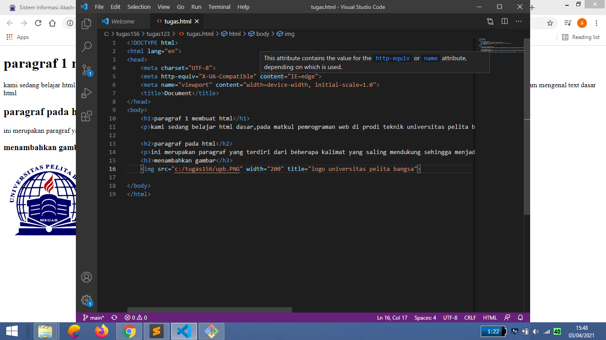
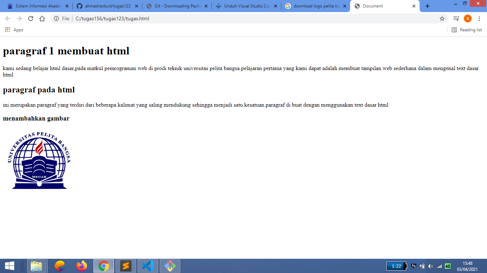

# tugas123
## membuat text dasar html
Di dalam HTML, untuk menampilkan text agar bisa tampil dengan spasi dan karakter sesuai aslinya (text tanpa format) kita memerlukan tag khusus, yakni tag. Jika di dalam tag biasa, HTML akan mengabaikan spasi antar karakter (apabila terdapat lebih dari 1 spasi secara berurutan), text yang berada di dalam tag akan ditampilkan dengan ‘apa adanya’.
### ini adalah hasil praktek saya

